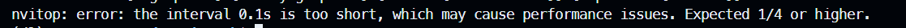
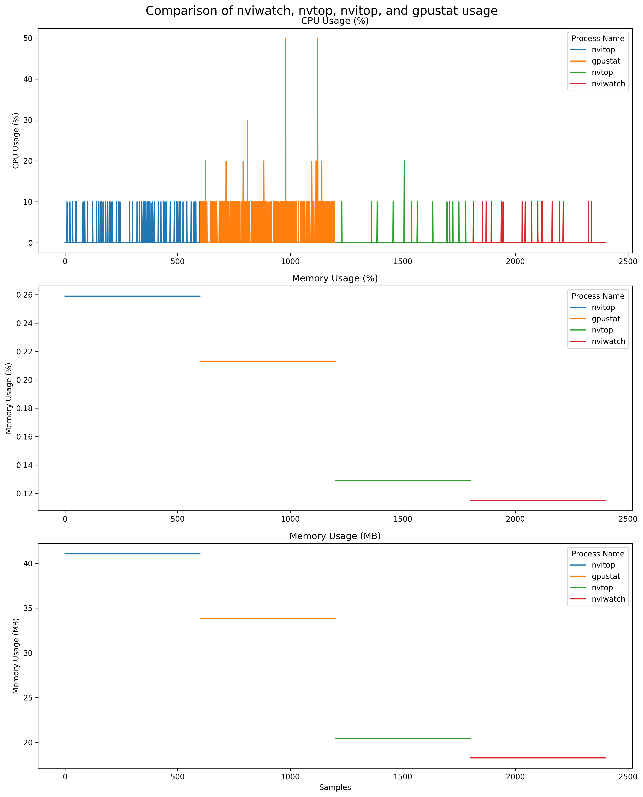
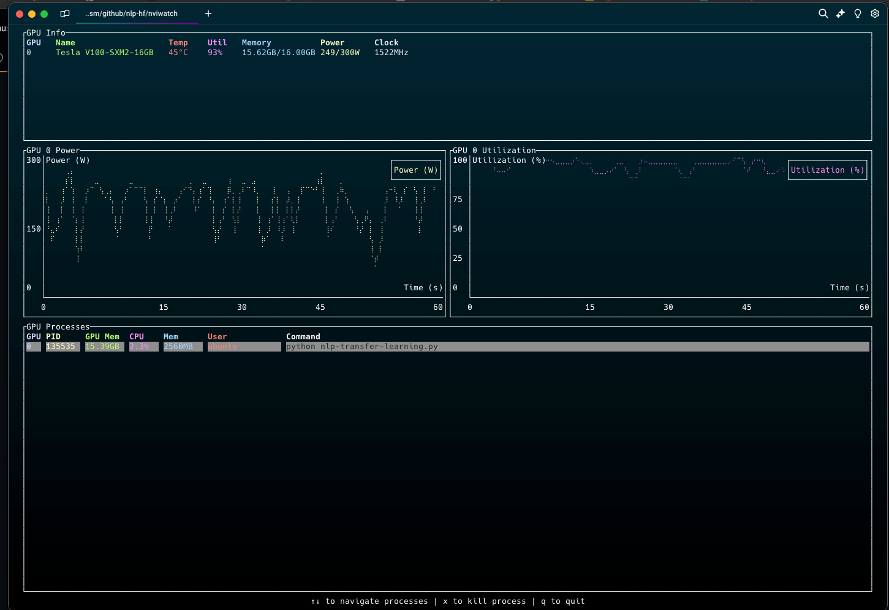
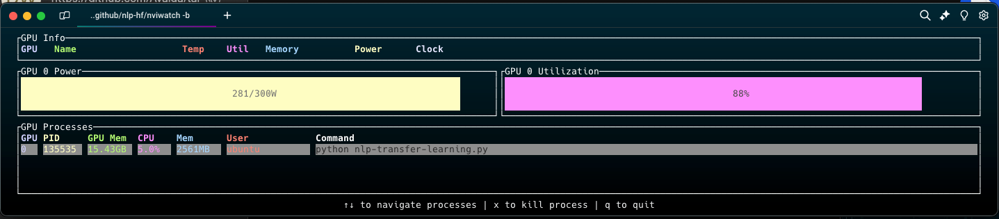
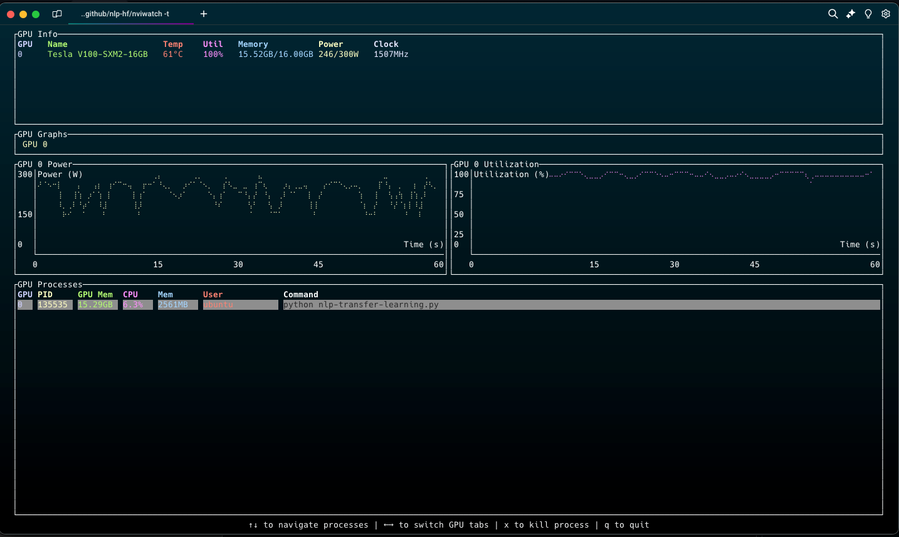

- [NviWatch](#nviwatch)
  - [Demo](#demo)
  - [Benchmarks](#benchmarks)
    - [Benchmark Results](#benchmark-results)
    - [Installation Size Comparison](#installation-size-comparison)
    - [Analysis](#analysis)
  - [Default Mode](#default-mode)
  - [Bar Mode](#bar-mode)
  - [Tabbed Mode: GPU graphs in tabs for multi GPU nodes](#tabbed-mode-gpu-graphs-in-tabs-for-multi-gpu-nodes)
  - [Features](#features)
  - [Installing and Using the Tool](#installing-and-using-the-tool)
    - [Option 1: Download Pre-built Binary](#option-1-download-pre-built-binary)
    - [Option 2: Install via Cargo](#option-2-install-via-cargo)
    - [Option 3: Build from Source](#option-3-build-from-source)
  - [Usage](#usage)
  - [Key Bindings](#key-bindings)
  - [License](#license)
  - [Contributing](#contributing)
  - [Acknowledgments](#acknowledgments)


# NviWatch

NviWatch is an interactive terminal user interface (TUI) application for monitoring NVIDIA GPU devices and processes. Built with Rust, it provides real-time insights into GPU performance metrics, including temperature, utilization, memory usage, and power consumption.

## Demo

https://github.com/user-attachments/assets/176565fe-4467-4129-b783-071543c52bf4

## Benchmarks

We conducted performance benchmarks comparing nviwatch with other popular GPU monitoring tools: nvtop, nvitop, and gpustat. The results demonstrate nviwatch's efficiency in terms of CPU and memory usage. All tools except nvitop were run at 100ms interval. nvitop was set to 250ms because that is the minimum allowed value. The benchmark scripts and logs are available in the benchmarks folder. The test system had 32 GB RAM.



### Benchmark Results

| Tool     | CPU Usage (%) |  Memory Usage (%) | Memory Usage (MB) |
|----------|---------------|-------------------|-------------------|
|          | Mean / Max    |   Mean / Max      |   Mean / Max      |
| nviwatch | 0.28 / 10.0   | 0.12 / 0.12       | 18.26 / 18.26     |
| nvtop    | 0.25 / 20.0   | 0.13 / 0.13       | 20.46 / 20.46     |
| nvitop   | 0.88 / 10.0   | 0.26 / 0.26       | 41.07 / 41.07     |
| gpustat  | 3.47 / 49.9   | 0.21 / 0.21       | 33.82 / 33.82     |



### Installation Size Comparison

We used [python-package-size](https://github.com/qertoip/python-package-size) for determining the pip package sizes. For nvtop We used this `apt show nvtop | grep Installed-Size`.

| Tool     | Package Size |
|----------|--------------|
| nviwatch | 1.98 MB      |
| nvitop   | 4.1 MB       |
| gpustat  | 3.7 MB       |
| nvtop    | 106 KB       |

### Analysis

- **CPU Usage**: nviwatch demonstrates excellent CPU efficiency, with an average usage of just 0.28% and a maximum of 10%. It outperforms gpustat and nvitop and is comparable to nvtop in terms of average CPU usage. Important to note that nvtop supports more GPUs than just Nvidia so nviwatch isn't a complete alternative for nvwatch.

- **Memory Usage**: nviwatch shows the lowest memory footprint among all tested tools, using only 0.12% of system memory on average, which translates to about 18.26 MB. This is notably less than nvitop (41.07 MB) and gpustat (33.82 MB), and slightly better than nvtop (20.46 MB).

- **Consistency**: nviwatch maintains consistent memory usage throughout its operation, as indicated by the identical mean and max values for memory usage.

- **Package Size**: At 1.98 MB, nviwatch offers a balanced package size. It's significantly smaller than nvitop (4.1 MB) and gpustat (3.7 MB), while being significantly larger than nvtop (106 KB).

## Default Mode 


## Bar Mode


## Tabbed Mode: GPU graphs in tabs for multi GPU nodes


## Features

- **Real-Time Monitoring**: View real-time data on GPU temperature, utilization, memory usage, and power consumption.
- **Process Management**: Monitor processes running on the GPU and terminate them directly from the interface.
- **Graphical Display**: Visualize GPU performance metrics using bar charts and tabbed graphs.
- **Customizable Refresh Rate**: Set the refresh interval for updating GPU metrics.

## Installing and Using the Tool

### Option 1: Download Pre-built Binary

1. Go to the project's GitHub repository.
2. Navigate to the "Releases" section.
3. Download the latest binary release for linux.
4. Once downloaded, open a terminal and navigate to the directory containing the downloaded binary.
5. Make the binary executable with the following command:
   ```
   chmod +x nviwatch
   ```

6. You can now run the tool using:

   ```
   ./nviwatch
   ```

### Option 2: Install via Cargo

If you have Rust and Cargo installed on your system, you can easily install NviWatch directly from crates.io:

1. Open a terminal and run the following command:
   ```bash
   cargo install nviwatch
   ```

2. Once the installation is complete, you can run NviWatch from anywhere in your terminal:
   ```bash
   nviwatch
   ```

Note: Ensure you have the NVIDIA Management Library (NVML) available on your system before running NviWatch.

### Option 3: Build from Source

To build and run NviWatch, ensure you have Rust and Cargo installed on your system. You will also need the NVIDIA Management Library (NVML) available.

1. Clone the repository:
   ```bash
   git clone https://github.com/yourusername/nviwatch.git
   cd nviwatch
   ```

2. Build the project:
   ```bash
   cargo build --release
   ```

3. Run the application:
   ```bash
   chmod +x ./target/release/nviwatch
   ./target/release/nviwatch
   ```

## Usage

NviWatch provides a command-line interface with several options:

- `-w, --watch <MILLISECONDS>`: Set the refresh interval in milliseconds. Default is 100 ms.
- `-t, --tabbed-graphs`: Display GPU graphs in a tabbed view.
- `-b, --bar-chart`: Display GPU graphs as bar charts.

Example:
```bash
./nviwatch --watch 500 --tabbed-graphs
```

## Key Bindings

- **q**: Quit the application.
- **↑/↓**: Navigate through the list of processes.
- **←/→**: Switch between GPU tabs (when using tabbed graphs).
- **x**: Terminate the selected process.

## License

This project is licensed under the GNU General Public License v3.0. See the [LICENSE](LICENSE) file for details.

## Contributing

Contributions are welcome! Please open an issue or submit a pull request for any improvements or bug fixes.

## Acknowledgments

- Built with [Rust](https://www.rust-lang.org/) and [Ratatui](https://github.com/ratatui/ratatui).
- Utilizes the [NVIDIA Management Library (NVML)](https://developer.nvidia.com/nvidia-management-library-nvml) via the [nvml_wrapper crate](https://docs.rs/nvml-wrapper/latest/nvml_wrapper/).
